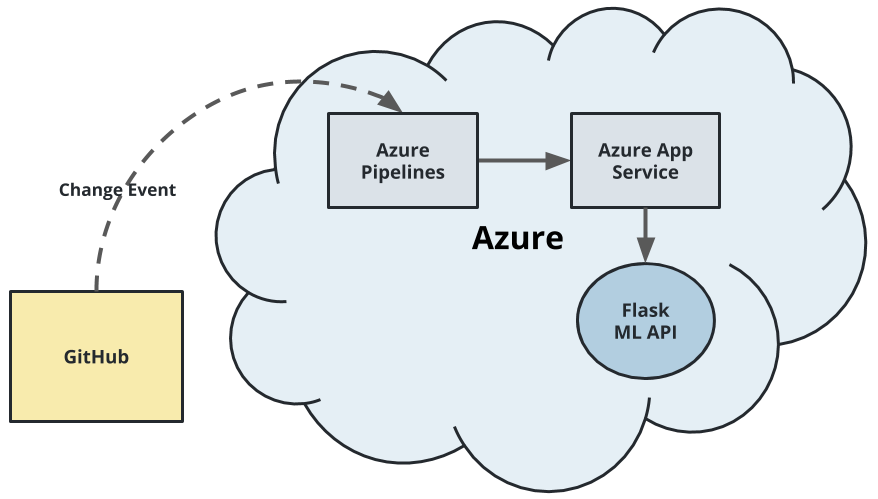
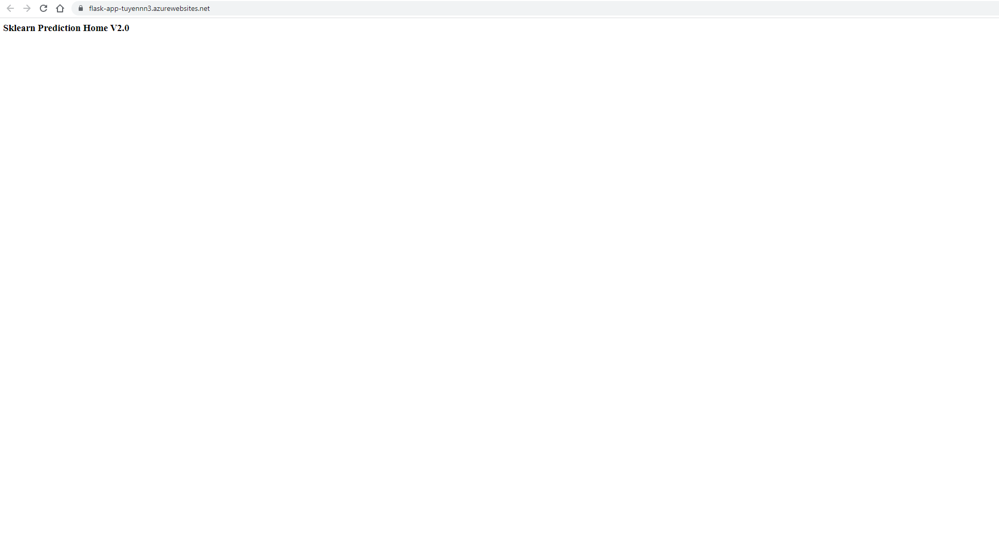
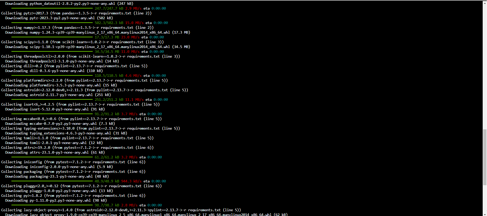
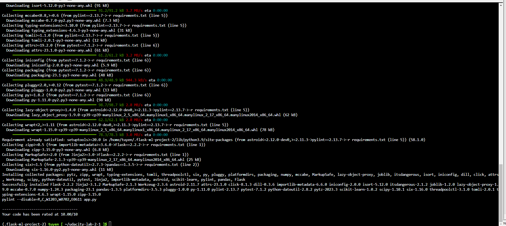
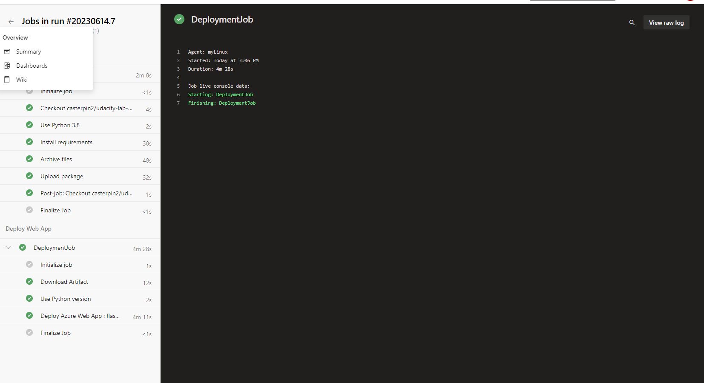
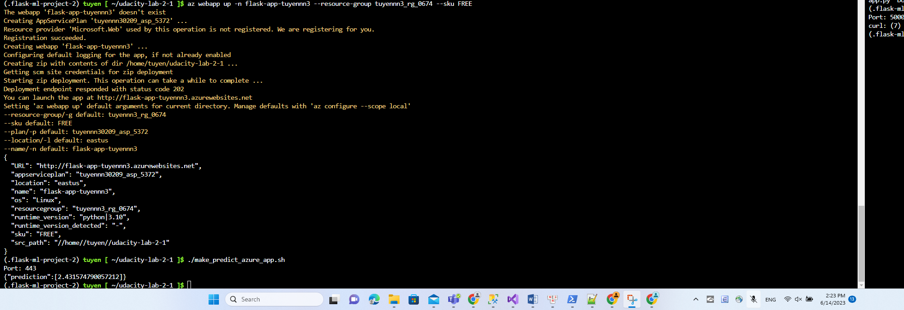
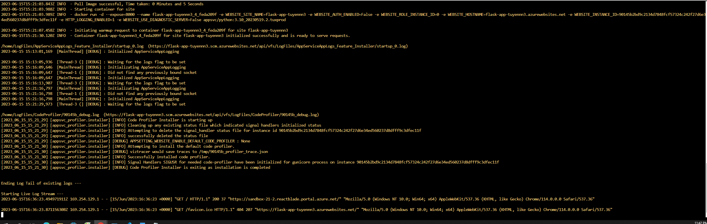
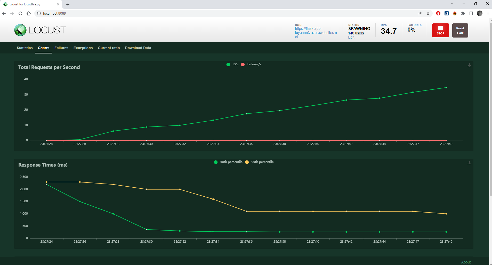
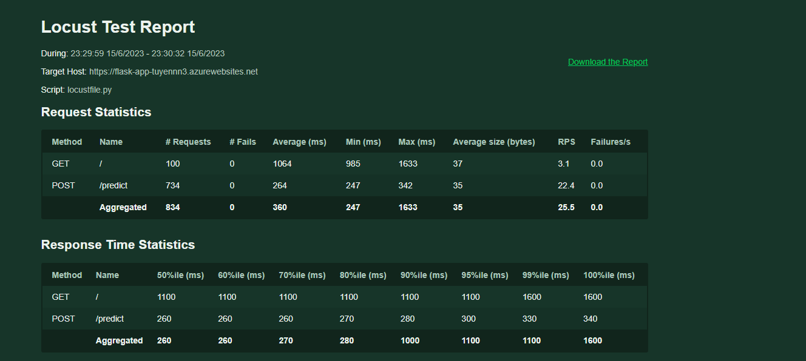

# Overview

Building a CI/CD Pipeline in Udacity Cloud DevOps using Microsoft Azure course

* Github Actions
https://github.com/casterpin2/udacity-lab-2-1/actions/runs/5281667488

* Azure DevOps Pipeline
https://dev.azure.com/tuyennn302090609/ProjectLabUdacity/_build/results?buildId=13&view=results

## Project Plan
<TODO: Project Plan

* A link to a Trello board for the project
 https://trello.com/invite/b/cortcw0h/ATTIf52e248fde5e011de1b19227aa8f3d70F8B71A86/udacityproject2
* A link to a spreadsheet that includes the original and final project plan>
https://docs.google.com/spreadsheets/d/1nvfKlratlH5HdoyHMtGiBE5B94lRrCl1xKcTu5zm7Bg/edit?usp=sharing

## Instructions


* Diagram>
<p>

</p>

** Python project (step):

* Azure App Service
<p>

</p>

* Project cloned
<p>

</p>

* Passing tests  `make all`
<p>

</p>
<p>

</p>
<p>

</p>


* Azure Pipelines
<p>

</p>

* Successful prediction from deployed flask app in Azure Cloud Shell.

```bash
udacity@Azure:~$ ./make_predict_azure_app.sh
```

<p>

</p>

* Output of streamed log files from deployed application

<p>

</p>

> 

* Locust load testing chart
<p>

</p>

* Locust load testing statics
<p>

</p>

<TODO: Add link Screencast on YouTube>
https://youtu.be/9mTjxxCEV2M

